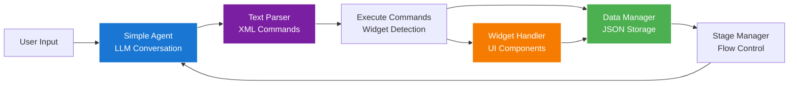
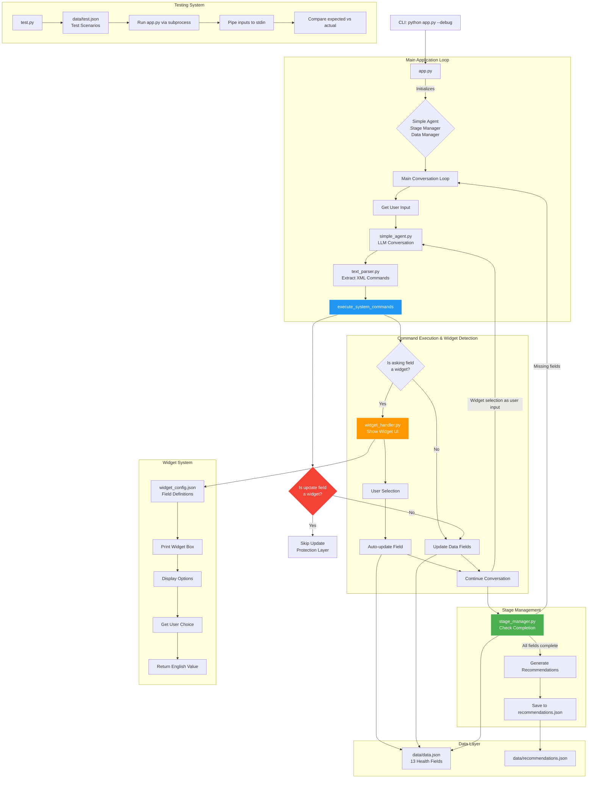

# Simple Onboarding - Implementation Flow

## High-Level Architecture

This document outlines the simplified architecture of the simple_onboarding system, focusing on clean separation of concerns and straightforward data flow.

## 🔍 Architecture Overview



**Key Principle**: Direct text parsing with XML tags, no function calls, self-contained widgets

## System Flow (Detailed)



## 📁 Module Responsibilities

### 1. **app.py** - Main Orchestrator

- Initializes all components
- Main conversation loop
- Handles widget completion flow
- Debug mode and prompt mode support

### 2. **simple_agent.py** - LLM Interface

- Direct OpenAI API integration
- Conversation history management
- Prompt building with stage context
- No function calling complexity

### 3. **stage_manager.py** - Flow Control

- Three-stage conversation management:
  - `GREETING` → `QUESTIONNAIRE` → `RECOMMENDATIONS`
- Stage transition logic
- Context loading for each stage
- Data completion checking

### 4. **text_parser.py** - Command Processing

- XML tag parsing: `<update>`, `<asking>`, `<action>`
- Clean extraction without complex tools
- Validation and error handling
- Recommendation action matching

### 5. **widget_handler.py** - UI Components

- Widget field detection
- Self-contained widget UI rendering
- User input handling
- English/Turkish option mapping
- Test mode compatibility

### 6. **data_manager.py** - Data Persistence

- 13-field health data management
- JSON file operations
- Field validation and type conversion
- Recommendations saving

### 7. **conversation_ui.py** - Terminal Interface

- User message display
- Agent message formatting
- Input prompts
- Clean terminal presentation

### 8. **test.py** - Automated Testing

- Subprocess-based app execution
- Multiple test scenario support
- Input sequence automation
- Result validation and reporting

## 🎯 Key Design Decisions

### 1. **No Function Calls**

- Uses direct text parsing instead of LLM function calling
- Simpler, more predictable behavior
- Easier debugging and testing

### 2. **Widget Integration Strategy**

```python
# In execute_system_commands():
if system_commands["asking"]:
    field = system_commands["asking"]
    if is_widget_field(field):
        selection = show_widget_for_field(field)
        # Auto-update field and continue conversation
        user_input = selection  # Natural conversation flow
```

### 3. **Protection Layer**

```python
# Prevent LLM from updating widget fields
for update in system_commands["updates"]:
    if is_widget_field(update["field"]):
        continue  # Skip widget field updates
```

### 4. **Self-Contained Widgets**

- Complete UI rendering in widget_handler.py
- No dependencies on main conversation loop
- Test mode detection at module level
- Direct English value return for data consistency

## 🔄 Conversation Flow Examples

### Normal Field Flow:

```
1. LLM: "What's your age?"
2. User: "28"
3. Parse: <update>"age":"28"</update>
4. Update: age = 28
5. Continue conversation
```

### Widget Field Flow:

```
1. LLM: "What's your gender?"
2. Parse: <asking>gender</asking>
3. Detect: gender is widget field
4. Show: Widget UI with options
5. User: Selects "2"
6. Return: "Female"
7. Update: gender = "Female"
8. Continue: conversation with "Female" as user input
```

## 🧪 Testing Architecture

### Test Scenario Structure:

```json
{
  "name": "Fresh User - Complete Journey",
  "existing_data": {},
  "inputs": {
    "age": "28",
    "gender": "2", // Widget option number
    "has_children": "1"
  },
  "expected_result": {
    "age": 28,
    "gender": "Female", // Expected English value
    "has_children": "No"
  }
}
```

### Test Execution Flow:

1. Reset data.json to clean state
2. Run app.py via subprocess
3. Pipe numbered inputs for widgets
4. Compare final data.json with expected results
5. Generate detailed test reports

## 🎨 Widget Configuration

### Widget Field Definition:

```json
{
  "gender": {
    "enabled": true,
    "question_text": "What is your gender?",
    "options": [
      { "value": "Male", "display_tr": "Erkek" },
      { "value": "Female", "display_tr": "Kadın" }
    ],
    "type": "select"
  }
}
```

### Widget UI Rendering:

```
┌─────────────────────────────────────────┐
│              🎛️  WIDGET UI               │
├─────────────────────────────────────────┤
│ 📝 What is your gender?                 │
│                                         │
│ Seçenekler:                             │
│  1) Erkek                               │
│  2) Kadın                            ✅ │
│                                         │
└─────────────────────────────────────────┘
```

## 🚀 Performance & Simplicity

### Advantages of Simple Architecture:

1. **Fast Development**: No complex tool setup
2. **Easy Debugging**: Clear text parsing visible in debug mode
3. **Reliable Testing**: Subprocess-based testing works consistently
4. **Maintainable**: Each module has single responsibility
5. **Extensible**: Easy to add new widget fields or test scenarios

### Trade-offs Accepted:

1. **Less Dynamic**: Fixed XML tag structure
2. **Manual Configuration**: Widget fields require manual setup
3. **Simple Validation**: Basic text parsing vs complex tool validation

This simplified architecture achieves the core functionality while maintaining clarity, testability, and ease of maintenance.
